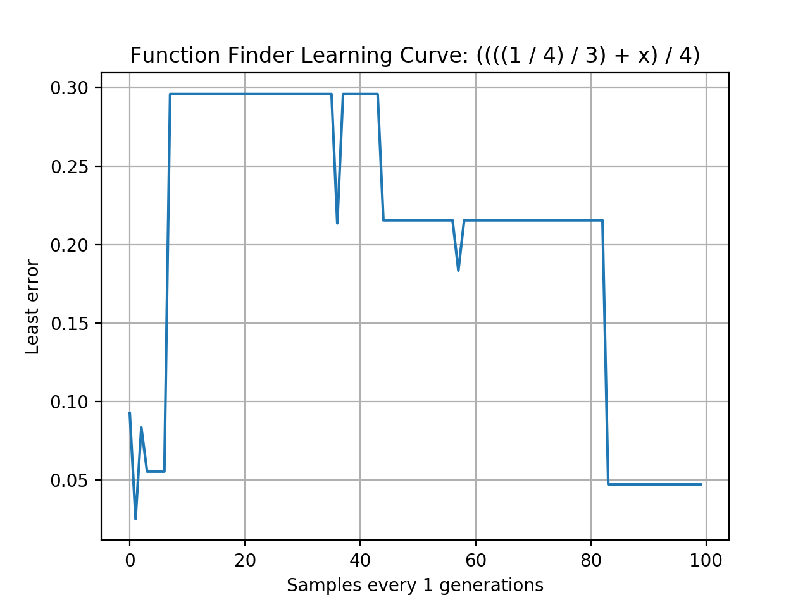

# FunctionFinderGenetic
Genetic program to approximate a function given a set of independent variables/values and Y values



## Overview
This project was an assignment for an algorithms course at Eastern Kentucky University, Spring 2019.

The assignment specification was to create a genetic program that could approximate a mathematical function given a 
list of independent variables and their values and dependent values. The particular values for this assignment are the 
following:

Independent variables:
```
X: [0.0, 0.1, 0.2, 0.3, 0.4, 0.5, 0.6, 0.7, 0.8, 0.9]
```

Dependent values:
```
0.0
0.005
0.020
0.045
0.080
0.125
0.180
0.245
0.320
0.405
```

The function we were trying to obtain was the following:
```
x^2 / 2
```

## Running
The program was run multiple times using various population sizes, generations, etc. The parameters used for
submission are included in the `values.json` file. These include a population size of `1000` and a max of `100` 
generations.

For the set of terminal symbols (tree leaves), the set of integers from -5 to 5 inclusive and the independent variables
were used. For functions (internal tree nodes), the set of addition, subtraction, multiplication, and division functions
was used. The design of the program allows for new functions (of any number of parameters) to be added easily.

The probability of whether a terminal symbol or function will be selected when growing a tree and the max height a tree
can grow to can be altered in the `values.json` file.

## Results
Here are the top 3 equations obtained after running the program 10 times:

|            Equation             | Square Error         |
|:-------------------------------:|----------------------|
| `(x / 3)`                       | 0.024991666666666676 |
| `((-5 * x) / (-3 / (-1 / -5)))` | 0.024991666666666676 |
| `((-5 * x) / (-3 / (-1 / -5)))` | 0.024991666666666676 |

After leaving the program to run until an ideal equation was generated, this equation was generated after 11 runs:

|              Equation              | Square Error          |
|:----------------------------------:|-----------------------|
| `(((x / 2) * x) + ((-5 * 1) + 5))` | 4.057242261750142e-33 |


## Requirements
#### Major
 * Python 3 (only tested on 3.6 and 3.7)
 TODO: not yet on 3.6!!!!
#### Python Packages (`pip3 install ...`)
Quick installation: `pip3 install -r requirements.pip`
 * matplotlib


## Usage
```
Usage:   python3 function_finder.py

Program parameters can be altered in the values.json file.

```

## Example Output
```
An ideal individual was found.
Error:  4.057242261750142e-33
(x * (x / 2))
```
